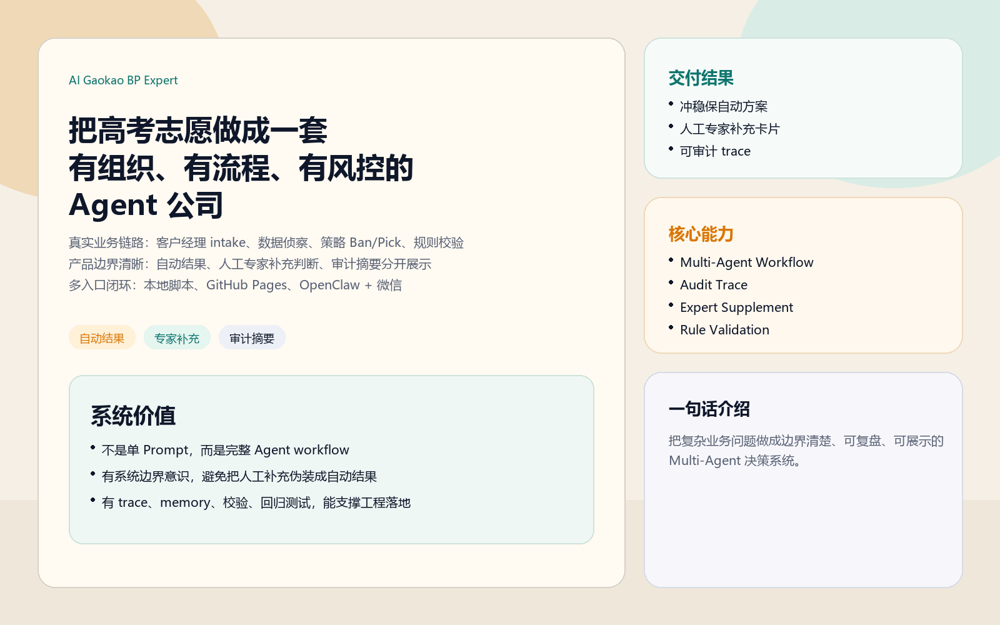
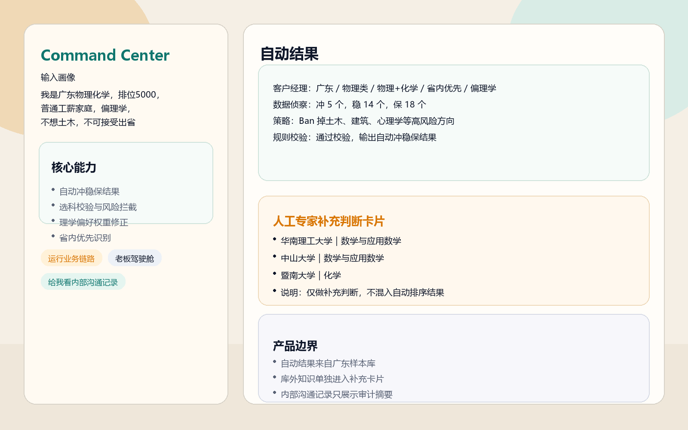
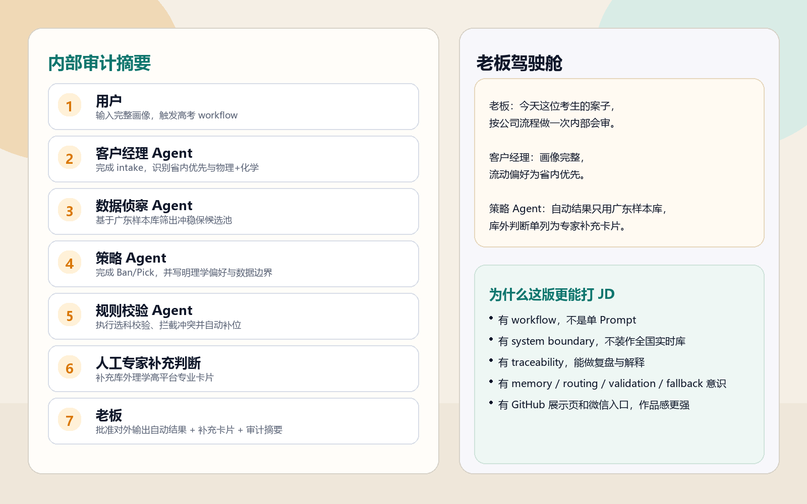

# AI Gaokao BP Expert

把高考志愿这个高约束、高风险、强解释性的决策问题，做成一套真正可运行的 Multi-Agent 决策系统。

这个项目不是“问一句答一句”的普通聊天机器人，而是把高考志愿拆成可审计、可复盘、可展示的业务链路：

- 自动结果：基于广东 2024 本地样本库，自动生成冲 / 稳 / 保方案
- 专家补充：把库外判断单独做成“人工专家补充判断卡片”，不伪装成自动结果
- 审计摘要：把内部协作过程落盘为 trace 时间线和老板驾驶舱，保证可解释性

## 项目亮点

### 1. 不是单 Prompt，而是完整业务链路

- `客户经理 Agent`：做 intake，结构化提取排位、科类、家庭情况、偏好
- `数据侦察 Agent`：从广东样本库筛出冲 / 稳 / 保候选池
- `策略 Agent`：执行 Ban/Pick，优先考虑就业兑现率、城市机会与现实约束
- `规则校验 Agent`：做选科匹配、去重、拦截、自动补位与风险提醒

### 2. 自动结果和人工补充分层展示

- 自动冲稳保方案只来自广东样本库
- 库外或专家判断单独进入“人工专家补充判断卡片”
- 避免把系统自动能力和人工补充判断混写，边界更清晰，更像真实产品

### 3. 内部记录可审计，而不是假装会调源码

- 每轮 workflow 会落盘 trace 时间线
- 支持“老板驾驶舱”查看内部会审摘要
- 内部沟通记录明确是 `审计摘要`，不是伪装出来的工具调用过程

### 4. 一套项目，两种公开展示场景

- `本地 Python 脚本`：适合开发和测试
- `GitHub Pages 静态页`：适合截图、说明和公开展示

## 核心产出

### 自动结果

- 输入自然语言画像后，自动输出冲 / 稳 / 保结果
- 带 Ban 清单、风险提醒、家庭与就业建议
- 对顶尖排位、理学偏好、省内优先等情况做了策略修正

### 人工专家补充判断卡片

- 专门承接样本库外知识，例如省外院校、理学高平台专业
- 与自动结果分开展示
- 明确标注“为什么适合”与“为什么不进自动结果”

### 审计摘要

- 内部 trace 时间线
- 老板驾驶舱会审摘要
- 会话记忆与画像状态

## 展示图

### 1. 首页总览



### 2. 命令中心与自动结果



### 3. 专家补充卡片与审计摘要



## 系统架构

### 第一层：真实业务 Agent

- `客户经理 Agent`
  负责采集用户画像，在字段不足时追问并支持多轮记忆
- `数据侦察 Agent`
  负责基于广东本地样本库缩小候选空间
- `策略 Agent`
  负责 Ban/Pick、偏好加权、平台权重与风险专业排除
- `规则校验 Agent`
  负责选科匹配、冲突拦截、重复去重与自动补位

### 第二层：展示型协作视图

- `产品经理`
  解释为什么要这样设计工作流
- `程序员`
  解释脚本、数据、路由与部署如何形成闭环
- `测试`
  解释边界场景、校验逻辑与回归测试

### 第三层：老板视角

- `老板驾驶舱`
  把一次分析当成一次内部会审
- `审计摘要`
  把内部协作保留为真实可解释的 trace，而不是虚构日志

## 仓库结构

```text
AI_Gaokao_BP_Expert/
├─ data/                         # 广东样本库与人工专家补充卡
├─ docs/                         # GitHub 展示页、文档、截图
├─ scripts/                      # 核心 Agent 脚本
├─ .gitignore
└─ README.md
```

## 关键脚本

- [gaokao_workflow.py](./scripts/gaokao_workflow.py)
- [wechat_agent_router.py](./scripts/wechat_agent_router.py)
- [intake_manager.py](./scripts/intake_manager.py)
- [data_scout.py](./scripts/data_scout.py)
- [strategy_agent.py](./scripts/strategy_agent.py)
- [rule_referee.py](./scripts/rule_referee.py)
- [expert_supplement.py](./scripts/expert_supplement.py)
- [agent_boardroom.py](./scripts/agent_boardroom.py)
- [showcase_roles.py](./scripts/showcase_roles.py)

## 快速开始

### 1. 本地直接跑完整 workflow

```bash
python scripts/gaokao_workflow.py --text "我是广东物理化学，排位5000，普通工薪家庭，偏理学，不想土木，不可接受出省"
```

### 2. 走微信同款自然语言入口

```bash
python scripts/wechat_agent_router.py --session-id demo_user --text "我是广东物理化学，排位5000，普通工薪家庭，偏理学，不想土木，不可接受出省"
```

你还可以继续发：

- `给我看老板驾驶舱`
- `给我看内部沟通记录`
- `我想看 Step 4 策略 Agent 输出`
- `给我看人工专家补充判断卡片`

### 3. 预览静态展示页

```bash
cd docs
python -m http.server 8099
```

打开：

`http://127.0.0.1:8099`

### 4. 重新生成 README 展示图

```bash
python scripts/generate_showcase_images.py
```

## 私有部署说明

这个公开版仓库只保留：

- 核心多 Agent 逻辑
- GitHub 展示页
- 截图、文档和测试

Docker / OpenClaw / 微信部署版建议继续放在你的私有仓库里，不建议公开。

## 测试

```bash
python scripts/test_multi_agent_pipeline.py
```

当前已覆盖：

- intake 追问逻辑
- 完整多 Agent workflow
- 会话记忆
- 负向流动偏好识别
- 理学偏好权重
- 人工专家补充判断卡片
- 微信路由与 trace 查看链路

## 相关文档

- [MULTI_AGENT_ARCHITECTURE_ZH.md](./docs/MULTI_AGENT_ARCHITECTURE_ZH.md)
- [AGENT_ROLE_MATRIX_ZH.md](./docs/AGENT_ROLE_MATRIX_ZH.md)
- [SHOWCASE_LAYER_ZH.md](./docs/SHOWCASE_LAYER_ZH.md)

## 一句话定位

这个项目最值钱的地方，不是“帮人查学校”，而是展示你能把一个复杂、高风险、强解释性的业务问题，做成一套边界清楚、可复盘、可展示的 Agent 系统。
