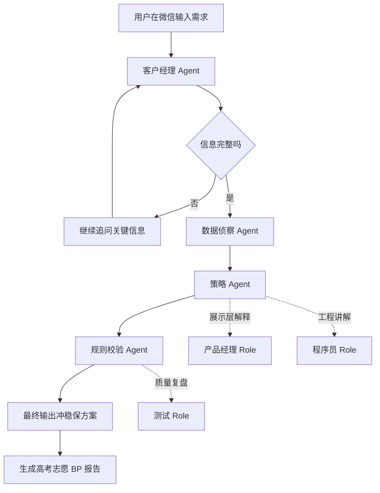

# AI Gaokao BP Expert 多 Agent 架构说明

## 1. 为什么要做双层结构

这个项目不应该只是一个“会聊天的高考机器人”，而应该同时具备两种价值：

1. 真实业务价值  
   真正帮助用户完成高考志愿 Ban/Pick 决策。

2. GitHub 展示价值  
   让浏览者一眼看出这不是单一聊天机器人，而是一套多角色、多阶段、多约束的系统。

因此，本项目采用“双层结构”：

- 第一层：真实业务 Agent
- 第二层：展示型协作视图

---

## 2. 第一层：真实业务 Agent

这层是主系统，决定项目的技术含金量。

### 2.1 客户经理 Agent

职责：

- 负责和考生进行多轮沟通
- 判断关键信息是否完整
- 主动追问缺失字段
- 把自然语言输入整理成标准化用户画像

最少需要采集的信息：

- 省份
- 排位 / 分数
- 物理类 / 历史类
- 家庭情况
- 地域偏好
- 专业偏好 / 明确排斥项

输入：

- 用户原始消息

输出：

- 标准化画像对象
- 缺失字段列表

工具：

- 对话状态记录
- 画像结构化模板

这是真 Agent，不只是 Role。因为它有独立目标、独立状态和独立输出。

### 2.2 数据侦察 Agent

职责：

- 读取本地高考数据集
- 根据排位和科类筛出候选学校和专业
- 输出“冲 / 稳 / 保”基础候选池

输入：

- 标准化用户画像

输出：

- 候选院校专业集合
- 基础分层结果

工具：

- `scripts/data_scout.py`
- `data/gd_2024_rankings.json`

这是真 Agent，因为它承担独立检索与筛选任务。

### 2.3 策略 Agent

职责：

- 负责做 Ban/Pick 决策
- Ban 掉高风险专业、投入产出比差的方向
- Pick 出冲稳保组合
- 输出现实主义解释

输入：

- 用户画像
- 候选池

输出：

- 冲稳保推荐
- Ban 清单
- 风险原因

工具：

- `prompts/realism_strategy.md`
- `scripts/run_bp_report.py`

这是真 Agent，是系统的核心决策脑。

### 2.4 规则校验 Agent

职责：

- 检查选科限制
- 检查明显不合理推荐
- 检查是否遗漏高风险提示
- 检查输出是否满足“可执行”

输入：

- 策略 Agent 输出

输出：

- 校验后的最终建议
- 风险告警

工具：

- 规则表
- 输出校验模板

这也是真 Agent，因为它承担质量把关和物理规则验证。

---

## 3. 第二层：展示型协作视图

这层主要为了 GitHub 展示和产品演示，不一定每个都是严格意义的 Agent。

### 3.1 产品经理

职责：

- 从业务角度解释为什么这样设计
- 把用户需求翻译成系统流程
- 解释为什么要追问、为什么要 Ban/Pick、为什么要做规则校验

更适合定位：

- 展示型 Role

### 3.2 程序员

职责：

- 从工程角度解释系统如何实现
- 说明脚本、数据、Prompt、OpenClaw 是如何串起来的
- 负责代码视角的讲解

更适合定位：

- 展示型 Role
- 如果未来让它真的生成补丁、修改配置、重构脚本，它也可以升级成工程 Agent

### 3.3 测试

职责：

- 负责挑错
- 验证输出是否遗漏
- 模拟极端输入
- 检查推荐是否和规则冲突

更适合定位：

- 当前阶段：展示型 Role
- 后续阶段：可升级成真正的 QA Agent

---

## 4. Agent 与 Role 的判断标准

### 4.1 什么是 Role

如果它只是换一种口吻、立场或说话风格，本质上仍然是同一个模型在说话，那它更像 Role。

比如：

- “我现在扮演产品经理”
- “我现在扮演测试”

这更多是 Prompt 级角色设定。

### 4.2 什么是 Agent

如果它具备下面这些要素，它更像真正的 Agent：

- 有独立目标
- 有独立输入
- 有独立输出
- 有独立工具
- 有自己的状态或记忆

所以在本项目里：

- 客户经理 Agent：是真 Agent
- 数据侦察 Agent：是真 Agent
- 策略 Agent：是真 Agent
- 规则校验 Agent：是真 Agent
- 产品经理：更偏 Role
- 程序员：当前更偏 Role，未来可升级
- 测试：当前更偏 Role，未来可升级

---

## 5. 推荐工作流

---

## 6. 当前项目与未来版本的对应关系

### 当前已经具备

- 客户经理 Agent V1（单轮画像抽取 + 缺失字段追问）
- 数据侦察 Agent（候选池分层）
- 策略 Agent（Ban/Pick 决策）
- 规则校验 Agent（规则拦截 + 自动补位）
- OpenClaw 微信接入
- 高考 BP 专家人格
- 本地数据筛选
- 中文 Ban/Pick 报告脚本

### 下一步应优先补

1. 客户经理 Agent 的多轮状态记忆
2. 策略 Agent 的更强 Prompt
3. 微信侧真实工具调用闭环
4. 展示层中的产品经理 / 程序员 / 测试协作视图

---

## 7. 架构总结

这套结构的目标，是把高考志愿分析从单次问答升级为一条边界清楚、可解释、可复盘的业务流程。
